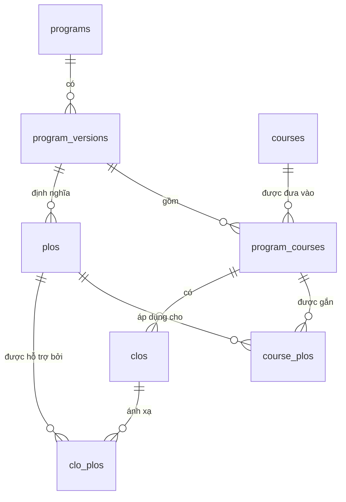

# Hướng dẫn sinh dữ liệu giống database OBE & AUN-QA

Tài liệu này hướng dẫn dựng lại database `obe_management` từ đầu, nạp dữ liệu CTĐT V1 và sinh dữ liệu PLO–CLO cho V2 theo đúng cấu trúc hiện tại của dự án.

## 1. Kết quả sau khi hoàn thành

Database có luồng dữ liệu chính:



| Bảng | Chức năng |
|---|---|
| `programs` | Lưu chương trình đào tạo, ví dụ Khoa học máy tính. |
| `program_versions` | Lưu từng phiên bản CTĐT như V1, V2 và trạng thái `draft`, `finalized`, `archived`. |
| `courses` | Danh mục học phần dùng chung. |
| `program_courses` | Học phần trong một phiên bản, kèm tên snapshot, tín chỉ, học kỳ và thứ tự. |
| `plos` | Các PLO chính thức của từng phiên bản CTĐT. |
| `course_plos` | Quan hệ nhiều-nhiều giữa học phần và PLO. |
| `clos` | Các CLO của từng học phần trong một phiên bản. |
| `clo_plos` | Quan hệ nhiều-nhiều giữa CLO và PLO. |

V1 là dữ liệu nguồn đã chốt. V2 được sinh lại từ V1 để áp dụng đầy đủ các ràng buộc PLO–CLO mà không làm thay đổi V1.

## 2. Công cụ cần có

- PostgreSQL đang chạy.
- Python 3.
- PowerShell đang đứng tại thư mục gốc dự án:

```powershell
cd "F:\THỰC TẬP TỐT NGHIỆP + ĐỒ ÁN TỐT NGHIỆP\ĐATN\OBE_AUN-QA_Management"
```

Các lệnh dưới đây giả định PostgreSQL được cài tại `F:\Postgre17\bin`. Nếu máy cài ở vị trí khác, thay đường dẫn này bằng thư mục chứa `psql.exe` và `createdb.exe`.

Kiểm tra công cụ:

```powershell
& "F:\Postgre17\bin\psql.exe" --version
python --version
```

Không ghi mật khẩu PostgreSQL vào source code hoặc commit lên Git. Tham số `-W` sẽ yêu cầu nhập mật khẩu trực tiếp.

## 3. Dựng database từ đầu

### Bước 1: Tạo database

```powershell
& "F:\Postgre17\bin\createdb.exe" -h localhost -p 5432 -U postgres -W obe_management
```

Nếu database đã tồn tại, bỏ qua bước này. Kiểm tra kết nối:

```powershell
& "F:\Postgre17\bin\psql.exe" -h localhost -p 5432 -U postgres -W -d obe_management -c "SELECT current_database(), current_user;"
```

### Bước 2: Tạo schema gốc

```powershell
& "F:\Postgre17\bin\psql.exe" -h localhost -p 5432 -U postgres -W -d obe_management -v ON_ERROR_STOP=1 -f "infra/postgres/001_curriculum.sql"
```

### Bước 3: Sinh file seed V1 từ JSON nguồn

File nguồn là `outputs/plo_clo_full_20260915/PLO_CLO_59_mon.json`.

```powershell
python "scripts/generate_plo_clo_seed.py"
```

Kết quả được tạo tại `outputs/plo_clo_full_20260915/seed_plo_clo_59_mon.sql`.

### Bước 4: Nạp dữ liệu V1

```powershell
& "F:\Postgre17\bin\psql.exe" -h localhost -p 5432 -U postgres -W -d obe_management -v ON_ERROR_STOP=1 -f "outputs/plo_clo_full_20260915/seed_plo_clo_59_mon.sql"
```

### Bước 5: Nâng cấp schema cho API CTĐT

Migration này bổ sung xóa mềm, trạng thái phiên bản, phiên bản nguồn và snapshot học phần. Migration không sửa nội dung PLO/CLO đã seed.

```powershell
& "F:\Postgre17\bin\psql.exe" -h localhost -p 5432 -U postgres -W -d obe_management -v ON_ERROR_STOP=1 -f "infra/postgres/004_curriculum_crud.sql"
```

### Bước 6: Kiểm tra V1

```powershell
& "F:\Postgre17\bin\psql.exe" -h localhost -p 5432 -U postgres -W -d obe_management -v ON_ERROR_STOP=1 -f "infra/postgres/003_verify_curriculum.sql"
```

Kết quả V1 mong đợi:

| Dữ liệu | Số lượng |
|---|---:|
| PLO | 5 |
| Học phần | 59 |
| Liên kết học phần–PLO | 146 |
| CLO | 146 |
| Liên kết CLO–PLO | 146 |

## 4. Sinh dữ liệu PLO–CLO cho V2

### 4.1. Quy tắc đang áp dụng

- Chỉ dùng 5 PLO chính thức đã có trong V1, không tự tạo thêm PLO.
- Mỗi học phần có ít nhất `min(số tín chỉ, 5)` PLO.
- Một học phần có từ 2 đến 5 CLO.
- Mỗi PLO được gắn cho học phần phải có ít nhất một CLO hỗ trợ.
- Mỗi CLO phải liên kết với ít nhất một PLO.
- Một CLO có thể liên kết với nhiều PLO; một PLO có thể được hỗ trợ bởi nhiều CLO.
- Điểm phân bố giữa các PLO phải nằm trong ngưỡng lệch 20% so với điểm trung bình.

Điểm cân bằng được tính như sau:

```text
Điểm PLO = tổng [tín chỉ học phần × trọng số liên kết]
```

Trong đó `X` có trọng số 2 và `Y` có trọng số 1.

### 4.2. Sinh JSON, SQL seed và báo cáo kiểm tra

```powershell
python "scripts/regenerate_plo_clo_v2.py"
```

Script tạo ba file:

```text
outputs/plo_clo_v2_20260917/PLO_CLO_59_mon_v2.json
outputs/plo_clo_v2_20260917/seed_plo_clo_v2.sql
outputs/plo_clo_v2_20260917/verification_report.json
```

- File JSON chứa dữ liệu dễ đọc và có thể dùng cho import/API sau này.
- File SQL dùng để nạp dữ liệu vào PostgreSQL.
- Báo cáo JSON ghi kết quả kiểm tra các ràng buộc trước khi nạp.

### 4.3. Nạp V2 vào PostgreSQL

```powershell
& "F:\Postgre17\bin\psql.exe" -h localhost -p 5432 -U postgres -W -d obe_management -v ON_ERROR_STOP=1 -f "outputs/plo_clo_v2_20260917/seed_plo_clo_v2.sql"
```

File seed chạy trong một transaction và thực hiện:

1. Tạo hoặc tìm phiên bản V2 ở trạng thái `draft`.
2. Sao chép 59 học phần từ V1 sang V2.
3. Nạp 5 PLO chính thức cho V2.
4. Sinh lại `course_plos`, `clos` và `clo_plos` của riêng V2.
5. Giữ nguyên toàn bộ dữ liệu V1.

Có thể chạy lại seed khi V2 vẫn là `draft`. Nếu V2 đã `finalized` hoặc `archived`, seed sẽ dừng để bảo vệ dữ liệu đã công bố.

### 4.4. Kiểm tra V2

```powershell
& "F:\Postgre17\bin\psql.exe" -h localhost -p 5432 -U postgres -W -d obe_management -v ON_ERROR_STOP=1 -f "infra/postgres/006_verify_plo_clo_v2.sql"
```

Kết quả V2 mong đợi:

| Dữ liệu | Số lượng |
|---|---:|
| PLO | 5 |
| Học phần | 59 |
| Liên kết học phần–PLO | 151 |
| CLO | 155 |
| Liên kết CLO–PLO | 210 |
| CLO liên kết từ 2 PLO trở lên | 55 |

Điểm cân bằng hiện tại:

| PLO | Điểm | Độ lệch so với trung bình |
|---|---:|---:|
| PLO1 | 160 | +10,65% |
| PLO2 | 169 | +16,87% |
| PLO3 | 117 | -19,09% |
| PLO4 | 160 | +10,65% |
| PLO5 | 117 | -19,09% |

Tất cả PLO đều nằm trong ngưỡng cho phép 20%.

## 5. Quy trình chạy nhanh khi đã có V1

```powershell
python "scripts/regenerate_plo_clo_v2.py"

& "F:\Postgre17\bin\psql.exe" -h localhost -p 5432 -U postgres -W -d obe_management -v ON_ERROR_STOP=1 -f "outputs/plo_clo_v2_20260917/seed_plo_clo_v2.sql"

& "F:\Postgre17\bin\psql.exe" -h localhost -p 5432 -U postgres -W -d obe_management -v ON_ERROR_STOP=1 -f "infra/postgres/006_verify_plo_clo_v2.sql"
```

Thứ tự luôn là: **sinh file → nạp SQL → kiểm tra**.

## 6. Câu lệnh kiểm tra dữ liệu thủ công

### Xem các phiên bản CTĐT

```sql
SELECT id, program_id, version_code, dataset_status, source_version_id
FROM curriculum.program_versions
ORDER BY id;
```

### Đếm dữ liệu theo phiên bản

```sql
SELECT
    pv.version_code,
    COUNT(DISTINCT pc.id) AS courses,
    COUNT(DISTINCT p.id) AS plos,
    COUNT(DISTINCT c.id) AS clos
FROM curriculum.program_versions pv
LEFT JOIN curriculum.program_courses pc
    ON pc.program_version_id = pv.id
   AND pc.archived_at IS NULL
LEFT JOIN curriculum.plos p ON p.program_version_id = pv.id
LEFT JOIN curriculum.clos c ON c.program_course_id = pc.id
GROUP BY pv.id, pv.version_code
ORDER BY pv.id;
```

### Xem mapping CLO–PLO của một môn

```sql
SELECT
    pc.course_name_snapshot AS course_name,
    c.code AS clo_code,
    c.statement AS clo_description,
    p.code AS plo_code
FROM curriculum.program_courses pc
JOIN curriculum.program_versions pv ON pv.id = pc.program_version_id
JOIN curriculum.clos c ON c.program_course_id = pc.id
JOIN curriculum.clo_plos cp ON cp.clo_id = c.id
JOIN curriculum.course_plos course_plo ON course_plo.id = cp.course_plo_id
JOIN curriculum.plos p ON p.id = course_plo.plo_id
WHERE pv.version_code = 'V2'
  AND pc.course_name_snapshot ILIKE '%Nhập môn lập trình%'
ORDER BY c.code, p.code;
```

## 7. Kết nối backend với database

Đặt chuỗi kết nối bằng đúng mật khẩu PostgreSQL trong cửa sổ PowerShell dùng để chạy backend:

```powershell
$env:ConnectionStrings__ObeDatabase = "Host=localhost;Port=5432;Database=obe_management;Username=postgres;Password=MAT_KHAU_THAT"
```

Không đưa mật khẩu thật vào `appsettings.json` nếu file đó được commit.

## 8. Xử lý lỗi thường gặp

### Lỗi `28P01: password authentication failed`

Sai mật khẩu hoặc backend vẫn dùng chuỗi kết nối cũ. Thử đăng nhập trực tiếp:

```powershell
& "F:\Postgre17\bin\psql.exe" -h localhost -p 5432 -U postgres -W -d obe_management
```

Nếu đăng nhập được, đặt lại biến `ConnectionStrings__ObeDatabase` trong đúng cửa sổ PowerShell chạy backend.

### Database không tồn tại

Tạo lại database ở Bước 1, sau đó chạy lần lượt schema, seed V1, migration và seed V2.

### Không tìm thấy file

Đảm bảo PowerShell đang đứng tại thư mục gốc dự án trước khi chạy các đường dẫn tương đối.

### V2 không còn là `draft`

Không seed đè lên phiên bản đã công bố. Hãy tạo mã phiên bản mới, hoặc chỉ đưa V2 về `draft` nếu đó thực sự là dữ liệu thử nghiệm.

### Seed dừng giữa chừng

Các seed chính dùng transaction và `ON_ERROR_STOP=1`. Khi có lỗi, PostgreSQL rollback thay vì để lại dữ liệu nửa chừng. Sửa nguyên nhân rồi chạy lại seed.

## 9. Lưu ý khi đưa lên Git

Thư mục `scripts` và `outputs` hiện đang bị bỏ qua trong `.gitignore`, nên `git add .` có thể không thêm các script sinh dữ liệu và file JSON/SQL đầu ra.

Để nhóm có thể tái tạo dữ liệu ở máy khác, cần quản lý phiên bản cho migration, file kiểm tra, script sinh dữ liệu và file JSON nguồn đã chốt. Không commit mật khẩu, chuỗi kết nối chứa mật khẩu hoặc bản dump có thông tin nhạy cảm.
